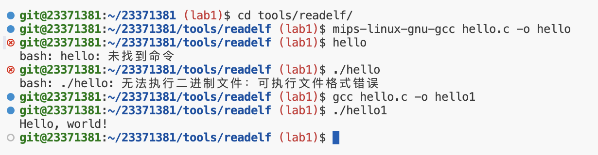
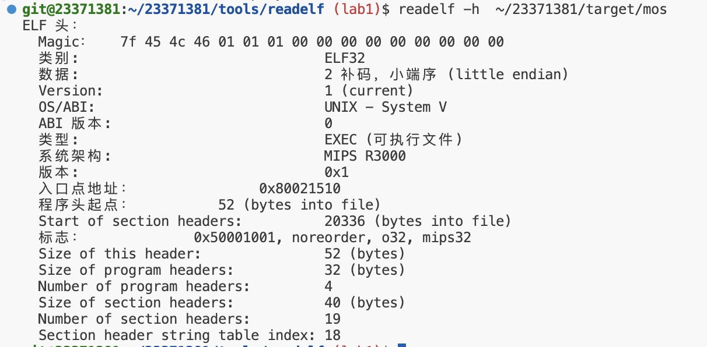
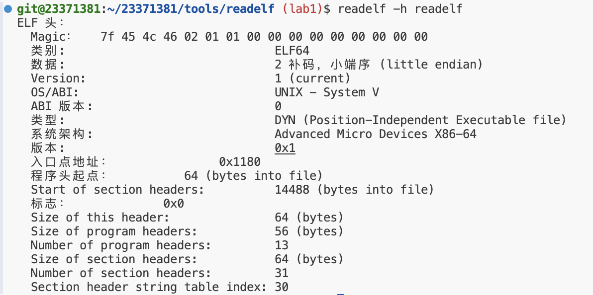
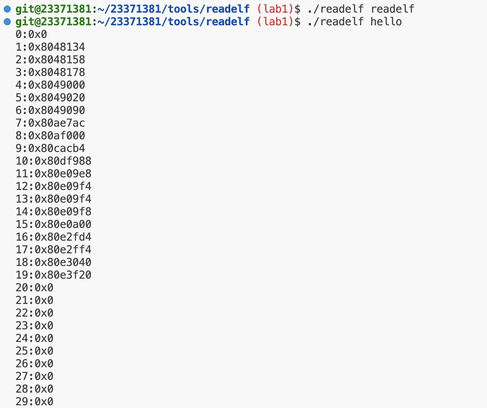

# Lab1

## 指导书学习笔记

### 一、Shell命令：

#### 1、赋值

* `=` :自动推导将最终的赋值作为该变量的值
* `:=` :覆盖式赋值，覆盖**之前**有过的赋值
* `?=` :某变量若前面已经定义赋值过，则不执行本次定义赋值，否则执行本次赋值

#### 2、Makefile中.PHONY写法：

* 可以在 `.PHONY`后面直接写所有伪目标，不用每个伪目标都写一次，如：

```shell
PHONY: all $(modules) clean
```

#### 3、几种$的用法：

* `$(...)` :变量引用，`$(variable_name)` 表示引用名为 `variable_name` 的变量。
* `$@` :Makefile中的自动变量，表示当前规则的目标。
  `$(MAKE) --dirtctory=$@`的执行效果与手动切换到模块目录再调用make 是一致的。
* `$$`:在Makefile 中，`$` 是一个特殊字符，如果想在命令中使用真正的 `$` 符号，需要用 `$$` 来转义它。
* `$<` :Makefile 中的另一个自动变量，表示当前规则的第一个依赖项。
* `$^` :Makefile 中的另一个自动变量，表示当前规则的所有依赖项。
* `$(shell ...)` :Makefile 中的 shell 函数，用于执行 shell 命令并返回结果替换回原位，相当于 `'shell'`。
* `$*` :Makefile 中的自动变量，表示当前规则的目标文件名（不包括扩展名）。

#### 4、几种括号的用法

* 双小括号：用于算术表达式（也可以在其中进行赋值），例如：

```shell
a=1
b=2
c=$((a + b))
echo $c # 3
((a = 10))
echo $a # 10
((b++))
echo $b 
```

* 单中括号：用于判断条件是否成立
  * 条件 `[ $a -ne 2 ]`，实际上是将 `a, -ne, 2, ]`作为参数传给可执行程序[，而不是表面上看起来像是用中括号包裹了判断语句 `$a -ne 2` 。
  * 这也就是为什么在判断条件[ `<condition>` ] 时一定需要有空格。
* 双中括号：同样用于判断条件，但相比单中括号提供了更为丰富的一些功能。
  * 在双中括号中可以直接使用逻辑运算：**[[ $a -gt 1 && $a -lt 100 ]]**，而使用单中括号只能写为 **[ $a -gt 1 ] && [ $a -lt 100 ]**

---

### 二、ELF中段和节：

#### 1、定义

* 节：如 `.data`、`.section`等，是一个可重定向（`.o`）文件或其他文件里面的一部分
* 段：由**多个节**组成，在可执行文件中，是由链接前的可重定向文件的节经过链接组成的
* 节头表：组成可重定位文件，参与可执行文件和可共享文件的链接。此时使用节头表。
* 段头表：组成可执行文件或者可共享文件，在运行时为加载器提供信息。此时使用段头表。

#### 2、节的对齐

在指导书里面的例子

```shell
user@debian ~/Desktop $ gcc -o test test.c -T test.lds -nostdlib -m32
user@debian ~/Desktop $ readelf -S test
共有 11 个节头，从偏移量 0x2164 开始：

节头：
[Nr] Name Type Addr Off Size ES Flg Lk Inf Al
[ 2] .text PROGBITS 00010000 001000 000018 00 AX 0 0 1
[ 5] .data PROGBITS 08000000 002000 00000e 00 WA 0 0 1
[ 6] .bss NOBITS 08000010 00200e 000004 00 WA 0 0 4
```

* 其中 **.data** 的 **Addr** 被定位到了 `08000000`，**Size** 为 `00000e`，下一个节应该从 `080000e`开始，但是 **.bss** 是 **四字节对齐** ，导致只能从 `080000e`的下一个四字节倍数的地址开始，即 `08000010`。

---

### 三、Linker Scripts

* 文件开头：

```c
/*
 * Set the architecture to mips.
 */
OUTPUT_ARCH(mips)

/*
 * Set the ENTRY point of the program to _start.
 */
ENTRY(_start)
```

其中 **`OUTPUT_ARCH(mips)`** 设置了最终生成的文件采用的架构，对于 MOS 来说就是 mips。而 **`ENTRY(_start)`** 便设置了程序的入口函数。因此 MOS 内核的入口即 **`_start`**。这是一个符号，对应的是 init/start.S 中的 **`EXPORT(_start)`**。

* Section部分代码示例：

```shell
SECTIONS
{
	. = 0x10000;
	.text : { *(.text) }
	. = 0x8000000;
	.data : { *(.data) }
	.bss : { *(.bss) }
}
```

* 注意Linker Script 文件编辑**冒号、等号**的两边需要有**空格**，否则可能会在编译的时候报语法错误。
* `.` 的作用：用来做定位计数器，根据输出节的大小增长，在SECTIONS
  命令开始的时候，它的值为0。通过设置“.”即可设置接下来的节的起始地址。
* ***!!!重点注意（debug好久）***
  **需要分号**：赋值、符号定义、表达式等独立语句。
  **不需要分号**：块结构、节定义等复合语句。

---

### 四、Boot相关MIPS代码编写：

#### 1、函数-->符号：

在 `Note 1.4.3`中写着

* mips_init 函数虽然为C 语言所书写，但是在被编译成汇编之后，其入口点
  成为一个符号。

故可以在 `start.S`中直接调用该C语言函数。

#### 2、预处理代码：

```
1 EXPORT(_start)
2 .set at
3 .set reorder
4 /* disable interrupts */
5 mtc0 zero, CP0_STATUS
```

* 本段代码中的 `EXPORT` 是一个宏，它将 `_start` 函数导出为一个符号，使得链
  接器可以找到它。可以简单的理解为，它实现了一种在汇编语言中的函数定义。
* 首先是 `_start` 函数的声明，随后2、3 行的 `.set`允许汇编器使用 `at`寄存器，也允许对接下来的代码进行重排序，第5 行禁用了外部中断。

---

### 五、C语言函数中变长参数

当函数参数列表末尾有省略号时，该函数即有变长的参数表。由于需要定位变长
参数表的起始位置，函数需要含有至少一个固定参数，且变长参数必须在参数表的末尾。

`stdarg.h` 头文件中为处理变长参数表定义了一组宏和变量类型如下：

* `va_list`：变长参数表的变量类型
* `va_start(va_list ap, lastarg)`：用于初始化变长参数表的宏
* `va_arg(va_list ap, 类型)`：用于取变长参数表下一个参数的宏
* `va_end(va_list ap)`：结束使用变长参数表的宏

其中 `lastarg` 为该函数最后一个命名的形式参数。

---

---


## 思考题

### 1.1



目前没搞清楚无法运行的原因

向`objdump`中传入参数的含义

```


--archive-headers 
-a 
显示档案库的成员信息,类似ls -l将lib*.a的信息列出。 

-b bfdname 
--target=bfdname 
指定目标码格式。这不是必须的，objdump能自动识别许多格式，比如： 

objdump -b oasys -m vax -h fu.o 
显示fu.o的头部摘要信息，明确指出该文件是Vax系统下用Oasys编译器生成的目标文件。objdump -i将给出这里可以指定的目标码格式列表。 

-C 
--demangle 
将底层的符号名解码成用户级名字，除了去掉所开头的下划线之外，还使得C++函数名以可理解的方式显示出来。 

--debugging 
-g 
显示调试信息。企图解析保存在文件中的调试信息并以C语言的语法显示出来。仅仅支持某些类型的调试信息。有些其他的格式被readelf -w支持。 

-e 
--debugging-tags 
类似-g选项，但是生成的信息是和ctags工具相兼容的格式。 

--disassemble 
-d 
从objfile中反汇编那些特定指令机器码的section。

-D 
--disassemble-all 
与 -d 类似，但反汇编所有section.

-EB 
-EL 
--endian={big|little} 
指定目标文件的小端。这个项将影响反汇编出来的指令。在反汇编的文件没描述小端信息的时候用。例如S-records. 


-f 
--file-headers 
显示objfile中每个文件的整体头部摘要信息。

-h 
--section-headers 
--headers 
显示目标文件各个section的头部摘要信息。  

-H 
--help 
简短的帮助信息。 

-i 
--info 
显示对于 -b 或者 -m 选项可用的架构和目标格式列表。 

-j name
--section=name 
仅仅显示指定名称为name的section的信息 

-l
--line-numbers 
用文件名和行号标注相应的目标代码，仅仅和-d、-D或者-r一起使用使用-ld和使用-d的区别不是很大，在源码级调试的时候有用，要求编译时使用了-g之类的调试编译选项。 

-m machine 
--architecture=machine 
指定反汇编目标文件时使用的架构，当待反汇编文件本身没描述架构信息的时候(比如S-records)，这个选项很有用。可以用-i选项列出这里能够指定的架构. 

--reloc 
-r 
显示文件的重定位入口。如果和-d或者-D一起使用，重定位部分以反汇编后的格式显示出来。 

--dynamic-reloc 
-R 
显示文件的动态重定位入口，仅仅对于动态目标文件意义，比如某些共享库。 

-s 
--full-contents 
显示指定section的完整内容。默认所有的非空section都会被显示。

-S 
--source 
尽可能反汇编出源代码，尤其当编译的时候指定了-g这种调试参数时，效果比较明显。隐含了-d参数。 

--show-raw-insn 
反汇编的时候，显示每条汇编指令对应的机器码，如不指定--prefix-addresses，这将是缺省选项。 

--no-show-raw-insn 
反汇编时，不显示汇编指令的机器码，如不指定--prefix-addresses，这将是缺省选项。 

--start-address=address 
从指定地址开始显示数据，该选项影响-d、-r和-s选项的输出。 

--stop-address=address 
显示数据直到指定地址为止，该项影响-d、-r和-s选项的输出。 

-t 
--syms 
显示文件的符号表入口。类似于nm -s提供的信息 


-T 
--dynamic-syms 
显示文件的动态符号表入口，仅仅对动态目标文件意义，比如某些共享库。它显示的信息类似于 nm -D|--dynamic 显示的信息。 

-V 
--version 
版本信息 

--all-headers 
-x 
显示所可用的头信息，包括符号表、重定位入口。-x 等价于-a -f -h -r -t 同时指定。 

-z 
--disassemble-zeroes 
一般反汇编输出将省略大块的零，该选项使得这些零块也被反汇编。

@file 可以将选项集中到一个文件中，然后使用这个@file选项载入。

```

——摘自CSDN

### 1.2



* mos的解析如上





如图，我们编写的 `readelf`不能解析 `readelf`文件本身，但是系统工具 `readelf`可以解析。

* 可能的原因：
  * 默认每个节大小相同，但是现实可能并非如此。
  * 并未解析符号表、重定位表等。
  * 未能链接动态库。

### 1.3

在我们的实验过程中，MOS操作系统是在QEMU模拟器上运行的，QEMU 已经提供了bootloader 的引导（启动）功能。MOS 操作系统不需要再实现bootloader
的功能。在MOS 操作系统的运行第一行代码前，我们就已经拥有一个正常的程序运行环境，内存和一些外围设备都可以正常使用。——指导书

---

---


## Exercise笔记

### 1.1

题目：

```
阅读tools/readelf 目录下的elf.h、readelf.c 和main.c 文件，并补全
readelf.c 中缺少的代码。readelf 函数需要输出ELF 文件中所有节头中的地址信息，对
于每个节头，输出格式为"%d:0x%x\n"，其中的%d 和%x 分别代表序号和地址。
```

我的作答：

```c
#include "elf.h"
#include <stdio.h>

/* Overview:
 *   Check whether specified buffer is valid ELF data.
 *
 * Pre-Condition:
 *   The memory within [binary, binary+size) must be valid to read.
 *
 * Post-Condition:
 *   Returns 0 if 'binary' isn't an ELF, otherwise returns 1.
 */
int is_elf_format(const void *binary, size_t size) {
	Elf32_Ehdr *ehdr = (Elf32_Ehdr *)binary;
	return size >= sizeof(Elf32_Ehdr) && ehdr->e_ident[EI_MAG0] == ELFMAG0 &&
	       ehdr->e_ident[EI_MAG1] == ELFMAG1 && ehdr->e_ident[EI_MAG2] == ELFMAG2 &&
	       ehdr->e_ident[EI_MAG3] == ELFMAG3;
}

/* Overview:
 *   Parse the sections from an ELF binary.
 *
 * Pre-Condition:
 *   The memory within [binary, binary+size) must be valid to read.
 *
 * Post-Condition:
 *   Return 0 if success. Otherwise return < 0.
 *   If success, output the address of every section in ELF.
 */

int readelf(const void *binary, size_t size) {
	Elf32_Ehdr *ehdr = (Elf32_Ehdr *)binary;

	// Check whether `binary` is a ELF file.
	if (!is_elf_format(binary, size)) {
		fputs("not an elf file\n", stderr);
		return -1;
	}

	// Get the address of the section table, the number of section headers and the size of a
	// section header.
	const void *sh_table;
	Elf32_Half sh_entry_count;
	Elf32_Half sh_entry_size;
	/* Exercise 1.1: Your code here. (1/2) */
	sh_table = binary + ehdr->e_shoff;
	sh_entry_size = ehdr->e_shentsize;
	sh_entry_count = ehdr->e_shnum;
	// For each section header, output its index and the section address.
	// The index should start from 0.
	for (int i = 0; i < sh_entry_count; i++) {
		const Elf32_Shdr *shdr;
		unsigned int addr;
		/* Exercise 1.1: Your code here. (2/2) */
		shdr = sh_table + i*sh_entry_size;
		addr = (int)(shdr->sh_addr);
		printf("%d:0x%x\n", i, addr);
	}

	return 0;
}

```

* 解题心得：
  在开始做这道题的时候，一直没认真看结构体定义，以为文件头表之后就是节头表，就想用文件头表的地址加上文件头表的大小去找节头表的地址😭，但是其实在 `Elf32_Ehdr`结构体里面描述的很清楚——节头表起始位置，节头表大小，节头表数量都有变量来表示，按照描述以及题意，循环输出就可以了，以下是文件头表：

```c
typedef struct {
	unsigned char e_ident[EI_NIDENT]; /* Magic number and other info */
	Elf32_Half e_type;		  /* Object file type */
	Elf32_Half e_machine;		  /* Architecture */
	Elf32_Word e_version;		  /* Object file version */
	Elf32_Addr e_entry;		  /* Entry point virtual address */
	Elf32_Off e_phoff;		  /* Program header table file offset */
	Elf32_Off e_shoff;		  /* Section header table file offset */
	Elf32_Word e_flags;		  /* Processor-specific flags */
	Elf32_Half e_ehsize;		  /* ELF header size in bytes */
	Elf32_Half e_phentsize;		  /* Program header table entry size */
	Elf32_Half e_phnum;		  /* Program header table entry count */
	Elf32_Half e_shentsize;		  /* Section header table entry size */
	Elf32_Half e_shnum;		  /* Section header table entry count */
	Elf32_Half e_shstrndx;		  /* Section header string table index */
} Elf32_Ehdr;
```

---

### 1.2

题目：

```c
填写kernel.lds 中空缺的部分，在Lab1 中，只需要填补.text、.data
和.bss 节，将内核调整到正确的位置上即可。
```

我的作答：

```c
/*
 * Set the architecture to mips.
 */
OUTPUT_ARCH(mips)

/*
 * Set the ENTRY point of the program to _start.
 */
ENTRY(_start)

SECTIONS {
	/* Exercise 3.10: Your code here. */

	/* fill in the correct address of the key sections: text, data, bss. */
	/* Hint: The loading address can be found in the memory layout. And the data section
	 *       and bss section are right after the text section, so you can just define
	 *       them after the text section.
	 */
	/* Step 1: Set the loading address of the text section to the location counter ".". */
	/* Exercise 1.2: Your code here. (1/4) */
	. = 0x80020000;
	/* Step 2: Define the text section. */
	/* Exercise 1.2: Your code here. (2/4) */
	.text : {*(.text)}
	/* Step 3: Define the data section. */
	/* Exercise 1.2: Your code here. (3/4) */
	.data : {*(.data)}
	bss_start = .;
	/* Step 4: Define the bss section. */
	/* Exercise 1.2: Your code here. (4/4) */
	.bss : {*(.bss)}
	bss_end = .;
	. = 0x80400000;
	end = . ;
}

```

* 解题心得：
  和第一题一样，也是没有仔细阅读，在mmu.h文件中已经画好了elf的内存布局图，只要按照布局图，把 `.text`放在 `0x80020000`，之后的 `.data` 和 `.bss`接着后面放即可，以下是mmu.h中的内存布局图。

```c
/*
 o     4G ----------->  +----------------------------+------------0x100000000
 o                      |       ...                  |  kseg2
 o      KSEG2    -----> +----------------------------+------------0xc000 0000
 o                      |          Devices           |  kseg1
 o      KSEG1    -----> +----------------------------+------------0xa000 0000
 o                      |      Invalid Memory        |   /|\
 o                      +----------------------------+----|-------Physical Memory Max
 o                      |       ...                  |  kseg0
 o      KSTACKTOP-----> +----------------------------+----|-------0x8040 0000-------end
 o                      |       Kernel Stack         |    | KSTKSIZE            /|\
 o                      +----------------------------+----|------                |
 o                      |       Kernel Text          |    |                    PDMAP
 o      KERNBASE -----> +----------------------------+----|-------0x8002 0000    |
 o                      |      Exception Entry       |   \|/                    \|/
 o      ULIM     -----> +----------------------------+------------0x8000 0000-------
 o                      |         User VPT           |     PDMAP                /|\
 o      UVPT     -----> +----------------------------+------------0x7fc0 0000    |
 o                      |           pages            |     PDMAP                 |
 o      UPAGES   -----> +----------------------------+------------0x7f80 0000    |
 o                      |           envs             |     PDMAP                 |
 o  UTOP,UENVS   -----> +----------------------------+------------0x7f40 0000    |
 o  UXSTACKTOP -/       |     user exception stack   |     PTMAP                 |
 o                      +----------------------------+------------0x7f3f f000    |
 o                      |                            |     PTMAP                 |
 o      USTACKTOP ----> +----------------------------+------------0x7f3f e000    |
 o                      |     normal user stack      |     PTMAP                 |
 o                      +----------------------------+------------0x7f3f d000    |
 a                      |                            |                           |
 a                      ~~~~~~~~~~~~~~~~~~~~~~~~~~~~~~                           |
 a                      .                            .                           |
 a                      .                            .                         kuseg
 a                      .                            .                           |
 a                      |~~~~~~~~~~~~~~~~~~~~~~~~~~~~|                           |
 a                      |                            |                           |
 o       UTEXT   -----> +----------------------------+------------0x0040 0000    |
 o                      |      reserved for COW      |     PTMAP                 |
 o       UCOW    -----> +----------------------------+------------0x003f f000    |
 o                      |   reversed for temporary   |     PTMAP                 |
 o       UTEMP   -----> +----------------------------+------------0x003f e000    |
 o                      |       invalid memory       |                          \|/
 a     0 ------------>  +----------------------------+ ----------------------------
 o
*/
```

---

### 1.3

题目：

```
完成init/start.S 中空缺的部分。设置栈指针，跳转到mips_init 函数。
```

我的作答：

```
#include <asm/asm.h>
#include <mmu.h>

.text
EXPORT(_start)
.set at
.set reorder
/* Lab 1 Key Code "enter-kernel" */
	/* clear .bss segment */
	la      v0, bss_start
	la      v1, bss_end
clear_bss_loop:
	beq     v0, v1, clear_bss_done
	sb      zero, 0(v0)
	addiu   v0, v0, 1
	j       clear_bss_loop
/* End of Key Code "enter-kernel" */

clear_bss_done:
	/* disable interrupts */
	mtc0    zero, CP0_STATUS

	/* hint: you can refer to the memory layout in include/mmu.h */
	/* set up the kernel stack */
	/* Exercise 1.3: Your code here. (1/2) */
	la sp KSTACKTOP

	/* jump to mips_init */
	/* Exercise 1.3: Your code here. (2/2) */
	j mips_init

```

* 解题心得：这道题只需要填写两行代码，而且也有明确要求
  * 第一步只需要在mmu.h中的内存布局图找到 `KSTACKTOP`，并检索到文件中对应的宏 `#define KSTACKTOP (ULIM + PDMAP`，之后将这个地址赋值给 `sp`寄存器即可
  * 第二步直接用 `j` 函数跳转即可：`j mips_init`

---

### 1.4

题目：

```
阅读相关代码和下面对于函数规格的说明，补全lib/print.c 中vprintfmt()
函数中两处缺失的部分来实现字符输出。第一处缺失部分：找到% 并分析输出格式; 第二处
缺失部分：取出参数，输出格式串为%[flags][width][length]<specifier> 的情况。
```

我的作答：

```c
void vprintfmt(fmt_callback_t out, void *data, const char *fmt, va_list ap) {
	char c;
	const char *s;
	long num;

	int width;
	int long_flag; // output is long (rather than int)
	int neg_flag;  // output is negative
	int ladjust;   // output is left-aligned
	char padc;     // padding char

	for (;;) {
		/* scan for the next '%' */
		/* Exercise 1.4: Your code here. (1/8) */
		const char * temp = fmt;
		while (*temp != '%' && *temp != '\0') {
			temp++;
		}
		/* flush the string found so far */
		/* Exercise 1.4: Your code here. (2/8) */
		out(data, fmt, temp-fmt);
		fmt = temp;
		/* check "are we hitting the end?" */
		/* Exercise 1.4: Your code here. (3/8) */
		if('\0' == *fmt) {
			break;
		}
		/* we found a '%' */
		/* Exercise 1.4: Your code here. (4/8) */
		fmt++;
		ladjust=0;
		padc=' ';
		/* check format flag */
		/* Exercise 1.4: Your code here. (5/8) */
		if('-' == *fmt) {
			fmt++;
			ladjust=1;
		}else if('0' == *fmt){
			fmt++;
			padc='0';
		}
		/* get width */
		/* Exercise 1.4: Your code here. (6/8) */
		width=0;
		while ('0' <= *fmt && *fmt <= '9' && *fmt != '\0') {
			width *= 10;
			width += *fmt - '0';
			fmt++;
		}
		/* check for long */
		/* Exercise 1.4: Your code here. (7/8) */
		long_flag = 0;
		if (*fmt == 'l') {
			long_flag = 1;
			fmt++;
		}
		neg_flag = 0;
		switch (*fmt) {
		case 'b':
			if (long_flag) {
				num = va_arg(ap, long int);
			} else {
				num = va_arg(ap, int);
			}
			print_num(out, data, num, 2, 0, width, ladjust, padc, 0);
			break;

		case 'd':
		case 'D':
			if (long_flag) {
				num = va_arg(ap, long int);
			} else {
				num = va_arg(ap, int);
			}

			/*
			 * Refer to other parts (case 'b', case 'o', etc.) and func 'print_num' to
			 * complete this part. Think the differences between case 'd' and the
			 * others. (hint: 'neg_flag').
			 */
			/* Exercise 1.4: Your code here. (8/8) */
			if(num<0) {
				neg_flag=1;
			}
			if(neg_flag) {
				print_num(out, data, -num, 10, 1, width, ladjust, padc, 0);
			}
			else{
				print_num(out, data, num, 10, 0, width, ladjust, padc, 0);
			}
			break;

		case 'o':
		case 'O':
			if (long_flag) {
				num = va_arg(ap, long int);
			} else {
				num = va_arg(ap, int);
			}
			print_num(out, data, num, 8, 0, width, ladjust, padc, 0);
			break;

		case 'u':
		case 'U':
			if (long_flag) {
				num = va_arg(ap, long int);
			} else {
				num = va_arg(ap, int);
			}
			print_num(out, data, num, 10, 0, width, ladjust, padc, 0);
			break;

		case 'x':
			if (long_flag) {
				num = va_arg(ap, long int);
			} else {
				num = va_arg(ap, int);
			}
			print_num(out, data, num, 16, 0, width, ladjust, padc, 0);
			break;

		case 'X':
			if (long_flag) {
				num = va_arg(ap, long int);
			} else {
				num = va_arg(ap, int);
			}
			print_num(out, data, num, 16, 0, width, ladjust, padc, 1);
			break;

		case 'c':
			c = (char)va_arg(ap, int);
			print_char(out, data, c, width, ladjust);
			break;

		case 's':
			s = (char *)va_arg(ap, char *);
			print_str(out, data, s, width, ladjust);
			break;

		case '\0':
			fmt--;
			break;

		default:
			/* output this char as it is */
			out(data, fmt, 1);
		}
		fmt++;
	}
}

/* --------------- local help functions --------------------- */
void print_num(fmt_callback_t out, void *data, unsigned long u, int base, int neg_flag, int length,
	       int ladjust, char padc, int upcase) {
	/* algorithm :
	 *  1. prints the number from left to right in reverse form.
	 *  2. fill the remaining spaces with padc if length is longer than
	 *     the actual length
	 *     TRICKY : if left adjusted, no "0" padding.
	 *		    if negtive, insert  "0" padding between "0" and number.
	 *  3. if (!ladjust) we reverse the whole string including paddings
	 *  4. otherwise we only reverse the actual string representing the num.
	 */

	int actualLength = 0;
	char buf[length + 70];
	char *p = buf;
	int i;

	do {
		int tmp = u % base;
		if (tmp <= 9) {
			*p++ = '0' + tmp;
		} else if (upcase) {
			*p++ = 'A' + tmp - 10;
		} else {
			*p++ = 'a' + tmp - 10;
		}
		u /= base;
	} while (u != 0);

	if (neg_flag) {
		*p++ = '-';
	}

	/* figure out actual length and adjust the maximum length */
	actualLength = p - buf;
	if (length < actualLength) {
		length = actualLength;
	}

	/* add padding */
	if (ladjust) {
		padc = ' ';
	}
	if (neg_flag && !ladjust && (padc == '0')) {
		for (i = actualLength - 1; i < length - 1; i++) {
			buf[i] = padc;
		}
		buf[length - 1] = '-';
	} else {
		for (i = actualLength; i < length; i++) {
			buf[i] = padc;
		}
	}

	/* prepare to reverse the string */
	int begin = 0;
	int end;
	if (ladjust) {
		end = actualLength - 1;
	} else {
		end = length - 1;
	}

	/* adjust the string pointer */
	while (end > begin) {
		char tmp = buf[begin];
		buf[begin] = buf[end];
		buf[end] = tmp;
		begin++;
		end--;
	}

	out(data, buf, length);
}

```

* 解题心得：这道题前半部分主要是解析 `fmt`字符串，根据给定格式 **`%[flags][width][length]<specifier>`，** **依次解析是否左对齐、左对齐所用符号、最小输出宽度、是否是 `long` 类型** ，最后解析对应的**占位符**并调用 `print_*`函数进行输出。
* 易错点：这道题有很多易错点，我自己几乎每个坑都踩了——
  * 函数主体是一个无限循环，每新一轮循环，用来标志的局部变量都未赋值，需要在循环中给每个变量先赋初始值在进行逻辑部分。
    * （如果
  * 对于 `d`类型的变量输出，需要注意判断正负：
    * 首先要判断解析出来的 `num`是否有负号
    * 若有负号，要给 `neg_flag`赋值为 **1**
    * 要在调用 `print_num`的时候传入参数 `neg_flag` 为 **1**
    * 由于在 `print_num` 函数中对于 `num` 的处理有位操作，是按正数的形式来操作的，所以在传入 `num`的时候，应该传入 `-num`。
